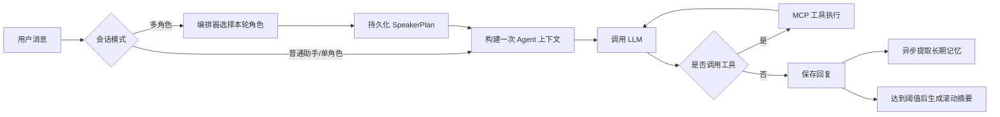
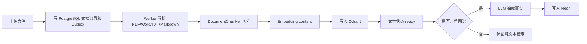
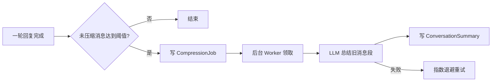

# Memory Agent 项目面试学习手册

> 目的：把简历中的四条项目亮点拆成能够真正讲明白的代码实现。阅读时不要死记术语，重点记住每项设计的“问题、方案、为什么这样做、有什么边界”。

## 0. 先记住项目的一句话定位

这是一个面向游戏 NPC 和个性化助手场景的多用户 Agent 平台，核心能力包括：

- 个人文档 RAG：Qdrant 文本向量检索，可选 Neo4j 图谱增强；
- 单角色与多角色 NPC：独立人设、权限、私有记忆和发言身份；
- 长期对话记忆：近期消息、滚动摘要、结构化长期记忆；
- MCP 工具调用：支持本地工具和需要联网授权的工具；
- 工程可靠性：请求幂等、后台任务、失败重试、能力降级和多用户隔离。

整体数据流可以先理解为：



## 1. 面试前必须知道的术语

### 1.1 Chunk

Chunk 是从文档中切出来的一小段文本。文档不能整篇直接放进模型：一方面可能超过上下文长度，另一方面整篇向量无法准确表达局部主题，因此需要先切分，再为每个 Chunk 生成向量。

### 1.2 Embedding

Embedding 是把文本转换成向量。语义接近的文本，其向量距离通常也更接近。项目使用 Embedding 查询 Qdrant，寻找和用户问题语义相近的 Chunk 或长期记忆。

### 1.3 RAG

RAG 是 Retrieval-Augmented Generation，即先检索证据，再把证据交给 LLM 生成回答。它解决的是“模型参数里没有用户私有资料”以及“知识需要随文档更新”的问题。

### 1.4 重排（Rerank）

初次检索的顺序不一定最好，因此需要重新计算排序。当前项目不是 Cross-Encoder 模型重排，而是：

```text
最终排序信号 = 原始检索分数 + 0.35 × 查询词项覆盖率
```

这属于轻量、确定性的规则重排。

### 1.5 Agent

本项目中的 Agent 不是独立进程，也不是每个角色一套模型。它是一个逻辑运行单元：拥有角色身份、人设、权限、可检索记忆和消息归属，并能经过 LLM 推理、选择和调用工具。

### 1.6 Outbox

Outbox 是一张数据库任务表。业务数据和“稍后要执行的外部操作”先一起写入 PostgreSQL，后台 Worker 再把任务同步到 Qdrant、Neo4j 或文件系统。这样外部服务临时失败时任务不会丢失。

---

# 2. 第一条亮点：文档切分与混合 RAG

## 2.1 简历原文

> 针对固定长度切分造成语义断裂、单纯向量召回难以处理实体关系的问题，设计段落与句末边界切分、重叠窗口及相邻上下文扩展，并融合 Qdrant 向量检索与 Neo4j 图谱证据，通过查询意图路由、词项覆盖重排和结果去重提升证据相关性。

这句话包含三个连续问题：

1. 文档怎么切，才能尽量不破坏语义？
2. 文本向量和图谱证据怎么一起召回？
3. 两路召回结果怎么重新排序并去重？

## 2.2 为什么固定长度切分会造成语义断裂？

假设固定每 20 个字切一次：

```text
原文：张三负责订单系统，李四负责支付系统。支付系统依赖订单系统生成的订单号。

错误切分：
Chunk 1：张三负责订单系统，李四
Chunk 2：负责支付系统。支付系统依
Chunk 3：赖订单系统生成的订单号。
```

“李四负责支付系统”被拆开后，任何一个 Chunk 都没有完整事实。即使向量召回了其中一个，也可能无法回答“谁负责支付系统”。

## 2.3 项目如何切分文档？

核心文件：`backend/app/services/document_chunker.py`

第一步先按空行划分段落：

```python
paragraphs = [
    part.strip()
    for part in re.split(r"\n\s*\n", text)
    if part.strip()
]
```

第二步，段落超过配置长度时，不立即从最大长度处硬切，而是向前寻找句末边界：

```python
boundary = max(
    paragraph.rfind("。", cursor, end),
    paragraph.rfind("！", cursor, end),
    paragraph.rfind("？", cursor, end),
    paragraph.rfind(". ", cursor, end),
    paragraph.rfind("\n", cursor, end),
)
if boundary > cursor + self.chunk_characters // 2:
    end = boundary + 1
```

这里的判断不是“发现任意标点都截断”，而是要求标点至少出现在当前窗口后半段。否则如果很早就遇到句号，会形成大量过短 Chunk。

第三步，下一段从 `end - overlap` 开始：

```python
cursor = max(cursor + 1, end - self.overlap_characters)
```

这就是重叠窗口。假设 Chunk 长度 1200 字、重叠 200 字，那么前一个 Chunk 结尾的 200 字还会出现在下一个 Chunk 开头，减少边界位置的信息丢失。

默认配置位于 `backend/app/core/config.py`：

```python
document_chunk_characters = 1200
document_chunk_overlap_characters = 200
document_context_window = 1
```

注意：这里是字符数，不是 Token 数。

## 2.4 什么是相邻上下文扩展？

每个 Chunk 同时保存两个字段：

- `content`：当前聚焦 Chunk，用于生成向量；
- `context_text`：当前 Chunk 加前后相邻 Chunk，用于最终交给 LLM。

对应代码：

```python
start = max(0, index - self.context_window)
end = min(len(focused), index + self.context_window + 1)
context = "\n\n".join(item[0] for item in focused[start:end])

PreparedChunk(
    content=content,
    context_text=context,
    page_number=unit.page_number,
    section=unit.section,
)
```

为什么不直接把 `context_text` 也拿去向量化？

- 聚焦 `content` 更容易准确表达当前段落主题；
- 召回后使用扩展的 `context_text`，能补充指代、前因后果和完整语境；
- 这是“召回精度”和“生成上下文完整性”之间的折中。

## 2.5 文档索引流程

核心文件：`backend/app/services/document_index_worker.py`



文档 Chunk 正文和页码、章节等来源信息保存在 PostgreSQL；Qdrant 保存 Chunk ID、向量和过滤字段；Neo4j 保存实体关系事实及其来源 Chunk。

文本向量完成后，文档即可进入 `ready`。图谱索引是独立状态，因此图谱失败不代表整篇文档不能检索。

## 2.6 为什么单纯向量召回不擅长实体关系？

向量检索擅长“语义相似”，例如：

```text
问题：系统为什么无法付款？
文本：支付服务连接超时会造成交易失败。
```

两句话字面不同，但语义相近，向量检索适合处理。

关系查询更接近结构化匹配，例如：

```text
张三 -> 负责 -> 订单系统
支付系统 -> 依赖 -> 订单系统
```

当用户询问“支付系统依赖谁”时，图结构能够沿着关系边直接查询。项目通过 LLM 从 Chunk 中抽取 `subject / predicate / object / confidence`，再写入 Neo4j。

## 2.7 混合检索是怎么执行的？

核心文件：`backend/app/services/document_knowledge_service.py`

向量检索：

```python
vector = await self.embedding_service.embed(normalized)
matches = await self.vector_store.search(
    vector=vector,
    user_id=user_id,
    limit=self.result_limit,
    score_threshold=self.relevance_threshold,
)
```

图谱检索：

```python
if retrieval_mode in {"auto", "hybrid"} and self.graph_store is not None:
    graph_rows = await self.graph_store.search(
        normalized, user_id, graph_limit
    )
```

两路结果最后统一成相同证据结构，包括：

- 文档 ID 和 Chunk ID；
- 文件名；
- 页码或章节；
- 证据类型 `text` / `graph`；
- 上下文文本；
- 分数。

这样 ContextBuilder 不需要关心证据来自 Qdrant 还是 Neo4j。

## 2.8 什么是查询意图路由？

项目没有用另一个复杂分类模型，而是先用关系关键词做轻量判断：

```python
relation_markers = (
    "关系", "关联", "之间", "谁", "属于", "影响", "依赖",
    "relationship", "related", "between", "who", "depends", "works on",
)
relational = any(marker in lowered for marker in relation_markers)
graph_limit = self.result_limit if relational else max(2, self.result_limit // 2)
graph_weight = 1.08 if relational else 0.45
```

含义是：

- 明显的关系问题：多取图谱结果，并略微提高图谱权重；
- 普通说明、步骤或故障问题：图谱只作为补充，避免宽泛的图事实压过原始段落。

它是规则路由，优点是快速、确定、无额外模型成本；缺点是关键词覆盖有限。

## 2.9 什么是词项覆盖重排？

项目会从问题和证据中提取英文词、数字、下划线词以及中文二元词组，然后计算：

```python
coverage = len(query_terms & evidence_terms) / len(query_terms)
```

最终排序：

```python
ranked = sorted(
    evidence,
    key=lambda item: (
        float(item["score"])
        + 0.35 * self._lexical_relevance(normalized, item),
        float(item["score"]),
    ),
    reverse=True,
)
```

为什么需要它？

向量检索可能召回主题相似但不包含关键错误码、角色名或业务名词的内容。词项覆盖率可以把包含精确关键词的证据向前提升。

当前实现还会特别识别“失败、错误、超时、重试”等故障意图词，避免“同主题的正常说明”排在“真正的故障处理说明”前面。

## 2.10 为什么还要去重？

同一个事实可能同时被向量检索和图谱检索命中；相邻重叠 Chunk 也可能包含相似内容。如果全部交给模型，会浪费上下文并重复强化某个证据。

```python
key = (item["document_id"], item["chunk_id"], item["content"][:200])
if key in seen:
    continue
```

项目最后只保留 `result_limit` 条证据。

## 2.11 这条亮点不能夸大的地方

- 当前不是 BM25 + Vector，而是 Vector + Graph + 规则词项信号；
- 当前没有 Cross-Encoder、BGE Reranker 等模型精排；
- 当前查询意图路由是关键词规则，不是训练出来的分类器；
- 当前切分长度按字符配置，不是按 Token；
- 目前没有真实业务标注集上的 Recall@K、MRR 或 NDCG 指标，不能编造提升百分比。

## 2.12 本节面试题

### Q1：为什么 Chunk 默认是 1200 字、Overlap 是 200 字？

参考回答：这是初始工程值，不是通过大规模实验得到的最优值。1200 字能够容纳一个相对完整的中文段落，200 字重叠用于缓解边界信息丢失，同时避免向量数量过度膨胀。生产优化应该按文档类型建立评测集，比较不同 Chunk 大小下的 Recall@K、上下文冗余和响应成本。

### Q2：Overlap 越大越好吗？

参考回答：不是。Overlap 增大会减少跨 Chunk 断裂，但会增加向量数量、存储成本和重复召回，最终还会浪费 LLM 上下文。需要在召回率和冗余之间权衡。

### Q3：为什么保留页码和 Section？

参考回答：它们用于证据溯源和引用展示，也便于排查错误召回。如果只保存文本，用户无法判断答案来自哪份文档的哪个位置。

### Q4：Qdrant 和 Neo4j 的分数能直接相加吗？

参考回答：不能严格直接比较。向量余弦分数和图谱事实置信度含义不同，所以项目先对图谱分数做限制和权重调整，再与词项覆盖信号组合。这是工程启发式方案，后续更严谨的方式是使用归一化、RRF 或学习排序。

### Q5：为什么不直接全部查询图谱？

参考回答：图谱抽取和查询都有额外成本，而且说明类、步骤类问题通常更需要原始文本。图谱适合关系问题，因此项目根据查询意图调节图谱召回数量和权重。

### Q6：如果 Embedding 服务失败怎么办？

参考回答：向量检索异常会记录 `document_vector_retrieval_failed`，图谱仍可以独立尝试；如果图谱也不可用，则没有文档证据，但基础聊天链路仍可继续，并明确记录降级原因。

### Q7：为什么不用 Elasticsearch/BM25？

参考回答：当前项目规模下先使用 Qdrant 语义召回和轻量词项重排，减少一个基础设施组件。BM25 对专有名词和精确关键词很有价值，后续数据量扩大后可以加入 Elasticsearch 或 PostgreSQL 全文检索，再使用 RRF 融合。

### Q8：如何证明 RAG 真的变好了？

参考回答：目前代码具备单元和集成测试，验证边界切分、来源保留、用户隔离、重排顺序和图谱故障降级。要证明业务效果，还需要构建标注问题—证据集，评估 Recall@K、MRR/NDCG、答案忠实度、引用准确率以及延迟。当前不能声称已经有线上百分比提升。

---

# 3. 第二条亮点：多角色路由与 SpeakerPlan

## 3.1 简历原文

> 针对多角色对话中发言混乱、重复生成和失败后无法恢复的问题，实现手动、@ 提及、轮询和 LLM 自动路由，并将发言结果持久化为 SpeakerPlan，通过请求幂等、执行进度和角色数量上限保证编排过程可控、可追踪、可恢复。

这条解决三个问题：

1. 谁应该发言？
2. 同一个请求重复发送时，如何避免重复生成？
3. 多个角色执行到一半失败，如何保留已经完成的结果？

## 3.2 这个项目算多 Agent 吗？

准确说法：它是“共享底层 LLM 的、中心化编排的逻辑多 Agent”。

每个角色有：

- 独立 ID、名称、人设；
- 独立知识库、工具、联网、图片和 TTS 权限；
- 角色私有长期记忆；
- 独立消息归属 `character_id`、`speaker_name`；
- 每次运行时独立构建上下文。

但是角色不是独立进程，也不一定使用不同模型。当前多角色由中央 `NpcOrchestrator` 选择，并按顺序执行。

## 3.3 四种发言路由

核心文件：`backend/app/services/npc_orchestrator.py`

### 手动路由

```python
if strategy == "manual":
    if target_character_id not in allowed:
        raise ValueError("Manual routing requires an enabled target character")
    return SpeakerPlanDecision([target_character_id], "manual_target")
```

用户发送消息前明确选择角色。后端仍校验角色是否属于当前会话，不能只相信前端 ID。

### @ 提及

```python
mentioned = [
    member.id
    for member in members
    if re.search(
        rf"(?<!\w)@{re.escape(member.name)}(?!\w)",
        content,
        re.IGNORECASE,
    )
]
```

唯一命中时让该角色发言；没有唯一命中时回退到第一个角色，保证结果确定。

### 轮询

```python
if previous_character_id in ids:
    index = (ids.index(previous_character_id) + 1) % len(ids)
else:
    index = 0
```

根据上一条角色消息选择下一位。轮询不需要 LLM，低成本且完全确定。

### LLM 自动路由

```python
routed = await self.llm_client.route_characters(
    content,
    [{"id": str(member.id), "name": member.name} for member in members],
    bounded,
)
```

LLM 只负责返回角色 ID 列表。后端继续校验：

```python
if (
    not selected
    or len(selected) != len(set(selected))
    or any(character_id not in allowed for character_id in selected)
):
    return SpeakerPlanDecision([members[0].id], "auto_invalid_fallback")
```

这里体现一个重要原则：模型输出是不可信输入，必须做格式、范围、重复和权限校验。

## 3.4 SpeakerPlan 是什么？

核心文件：`backend/app/models/speaker_plan.py`

关键字段：

```python
request_id       # 本次请求的唯一标识
strategy         # manual / mention / round_robin / auto
speaker_ids      # 确定的发言角色及顺序
reason_code      # 为什么选择这些角色
status           # pending / running / complete / failed
current_index    # 已经执行到第几个角色
duration_ms      # 总耗时
error_code       # 失败类型
```

数据库唯一约束：

```python
UniqueConstraint(
    "conversation_id",
    "request_id",
    name="uq_speaker_plan_request",
)
```

同一会话下，同一个请求 ID 最多只有一个发言计划。

## 3.5 什么叫请求幂等？

幂等是指同一个请求重复执行，不会重复产生业务副作用。

常见场景：前端发送成功，但网络在收到响应前断开，于是用户点击重试。没有幂等保护时，数据库可能保存两条相同用户消息并生成两轮 NPC 回复。

项目使用 `client_request_id / request_id`：

1. 第一次请求保存用户消息和 SpeakerPlan；
2. 重试时按请求 ID 查询已有计划；
3. 如果内容或联网权限不同，报 `idempotency_conflict`；
4. 如果计划已经完成，直接回放已保存结果；
5. 如果计划部分完成，从 `current_index` 继续。

对应代码位于 `ChatService._prepare_group_request()`。

## 3.6 多角色如何协作？

项目使用“中央编排器 + 共享会话历史”的协作方式，而不是 Agent 之间发送私有消息。

```python
for index in range(plan.current_index, len(speakers)):
    speaker = speakers[index]
    messages, tools, citations, degradations, effective_network = (
        await self._build_group_context(..., speaker, ...)
    )
    turn = await self._execute_speaker(...)
    response = await self._save_group_response(..., speaker, plan.id, index)
```

关键点是每个角色生成成功后先写入 `ChatMessage`，再构建下一个角色的上下文。因此角色 B 能看到角色 A 刚刚保存的回复。

这类似共享黑板：数据库中的会话历史就是所有角色共同读取的黑板。

## 3.7 为什么顺序执行，而不是并行？

如果两个角色并行生成，它们看到的是同一份旧上下文，可能重复回答或互相矛盾。顺序执行使后发言角色可以回应前一角色。

顺序执行的优点：

- 对话顺序确定；
- 后一个角色可以看到前一个角色的输出；
- 容易持久化进度；
- 容易处理部分失败。

缺点：总延迟随角色数量线性增加。未来对于相互独立的研究或检索任务，可以并行执行，再由汇总 Agent 合并。

## 3.8 如何处理执行一半失败？

保存单个角色回复时，数据库会锁定 SpeakerPlan：

```python
plan = await session.get(SpeakerPlan, plan_id, with_for_update=True)
if plan is None or plan.current_index != plan_index:
    raise RuntimeError("Speaker plan progress conflict")

session.add(message)
plan.current_index = plan_index + 1
plan.status = "running"
```

角色回复和进度在同一个事务中更新，因此不会出现“消息保存了但进度没更新”或相反的情况。

流式执行失败时，会返回：

```python
{
    "type": "error",
    "partial_saved": bool(responses),
    "completed_messages": [...],
}
```

已经完成的角色回复不会丢失。后续用相同请求 ID 重试，从 `current_index` 继续。

## 3.9 如何防止无限发言？

最终角色上限取多个限制中的最小值：

```python
limit = min(
    requested_max_speakers or conversation.max_speakers_per_turn,
    conversation.max_speakers_per_turn,
    conversation.max_group_generations,
    self.server_max_speakers,
    self.server_max_group_generations,
)
```

这意味着即使前端传入一个很大的数字，也不能突破会话配置和服务端全局上限。

## 3.10 这条亮点不能夸大的地方

- 当前角色共用底层 LLM Client，不是多个独立模型服务；
- 当前是中心化编排，不是完全自治的 Agent 社会；
- 当前主要解决“谁发言”，还没有 Planner 自动拆解复杂任务；
- 当前顺序执行，不是并行多 Agent；
- Agent 间主要通过共享聊天历史协作，没有独立消息总线；
- 角色的 `generation_settings` 已保存，但尚未接入每次 LLM 请求，不能说每个角色已有独立采样参数。

## 3.11 本节面试题

### Q1：这个项目为什么不只是多角色 Prompt？

参考回答：如果只是把多个人设拼进一个 Prompt，消息无法稳定归属到具体角色，也没有独立权限、私有记忆、路由、执行状态和失败恢复。本项目把角色作为持久化实体，每次按角色独立构建上下文并保存消息归属，因此是逻辑 Agent，而不只是一次 Prompt 模拟多人说话。

### Q2：为什么要把路由计划写数据库？

参考回答：计划不仅用于执行，还承担请求幂等、服务重启恢复、部分失败续跑和审计作用。放在进程内存中，服务一重启就无法知道已经选择了谁、执行到哪里。

### Q3：为什么不使用 Redis 保存计划？

参考回答：Redis 可以作为锁或缓存，但 SpeakerPlan 需要和用户消息、角色回复形成长期一致关系。PostgreSQL 的唯一约束和事务更适合作为事实来源。

### Q4：自动路由模型返回不存在的角色怎么办？

参考回答：后端会验证 UUID、去重、成员关系和数量上限。任何非法结果都不会直接执行，而是回退到第一个有效角色，并记录 `auto_invalid_fallback`。

### Q5：如何防止相同请求并发执行两次？

参考回答：数据库对会话和请求 ID 有唯一约束；单个角色消息对计划 ID 和计划序号也有唯一定位；保存回复时锁定计划并校验 `current_index`。应用层还对同一用户和请求 ID 使用异步锁。

### Q6：为什么没有使用 LangGraph？

参考回答：当前工作流是确定的路由、顺序生成、持久化进度和重试恢复，自定义状态机可以直接结合数据库事务、SSE 和权限控制。未来出现复杂条件分支、人工审批、循环反思或 Planner/Executor/Reviewer 时，LangGraph 会更合适。

### Q7：AutoGen 和当前方案有什么区别？

参考回答：AutoGen 更偏多个 Agent 通过对话协作，适合快速搭建代理间通信。本项目更强调面向产品的会话持久化、角色权限、幂等和故障恢复，因此选择了更可控的中心化编排。

### Q8：如果要并行化多 Agent，怎么改？

参考回答：只并行没有上下文依赖的角色任务，为每个分支保存独立子任务状态，使用 `asyncio.gather` 或任务队列并发执行，再增加汇总 Agent。必须同时解决超时、部分成功、顺序确定、成本上限和结果冲突。

---

# 4. 第三条亮点：分层上下文与角色记忆隔离

## 4.1 简历原文

> 针对长对话上下文持续增长及角色记忆串扰问题，采用“近期消息、滚动摘要、结构化长期记忆”的分层上下文策略，并通过会话共享与角色私有作用域隔离记忆，在控制上下文长度的同时保持人物设定和历史事实一致。

这条解决两个问题：

1. 聊天越来越长，不可能把所有原始消息一直发送给 LLM；
2. 多角色共享会话时，不能让角色 A 的私有认知无条件泄露给角色 B。

## 4.2 为什么不能把全部聊天历史发给模型？

- 模型上下文有上限；
- Token 越多，请求成本和首 Token 延迟越高；
- 大量旧消息会稀释当前问题相关信息；
- 超限时模型 API 会直接报错。

但简单删除旧消息又会让 NPC 忘记长期剧情，所以需要分层保存。

## 4.3 三层上下文分别负责什么？

### 第一层：近期消息

保留最近的原始用户和助手消息，优点是信息完整，适合承接当前对话。

```python
.order_by(ChatMessage.id.desc())
.limit(self.recent_message_limit)
```

默认读取最近 30 条消息。

### 第二层：滚动摘要

当未压缩消息达到阈值时，把较早的一段消息总结成摘要，同时保留最近若干条原始消息。

默认配置：

```python
summary_trigger_messages = 40
summary_keep_recent = 20
```

达到 40 条后，将较早部分加入压缩任务，但最后 20 条继续保留原文参与近期上下文。

摘要保存：

- 覆盖的起始和结束消息 ID；
- 摘要版本；
- 完成或失败状态；
- 错误信息。

原始聊天消息不会因为生成摘要而删除，摘要只是上下文压缩层。

### 第三层：结构化长期记忆

每轮回答后异步从用户消息和 Agent 回复中抽取值得长期保存的事实，例如：

```text
用户喜欢低糖咖啡。
玩家已经取得北城门钥匙。
艾琳答应在午夜前准备药剂。
```

这些事实生成向量，后续根据当前问题语义召回，而不是每轮全部塞进 Prompt。

## 4.4 摘要任务如何工作？

核心文件：`backend/app/services/compression_service.py`



Worker 使用：

```python
.with_for_update(skip_locked=True)
```

这允许多个 Worker 竞争任务时跳过已被其他 Worker 锁定的记录，避免重复处理。

失败后：

```python
job.attempts += 1
job.next_retry_at = now + timedelta(
    seconds=min(300, 2 ** min(job.attempts, 8))
)
```

超过最大次数后，任务进入 `failed`，并保存错误摘要记录供前端查看和手动重建。

## 4.5 上下文预算如何控制？

核心文件：`backend/app/services/context_builder.py`

系统先构造多个 Prompt Section：

1. 平台系统提示；
2. 权限和联网说明；
3. 工具描述；
4. 场景状态；
5. 角色人设；
6. Skill；
7. 长期记忆；
8. 知识库证据；
9. 早期摘要。

然后预留近期消息空间：

```python
reserved_recent = min(
    12000,
    max(256, self.max_context_characters // 3),
)
system_budget = self.max_context_characters - reserved_recent
```

系统区段按优先级放入预算：

```python
for index, (name, section) in enumerate(sections):
    if used + separator + len(section) > budget:
        if index == 0 and budget > 0:
            selected.append(section[:budget])
        continue
```

最后从最新消息向前选择，直到预算用完。

重要边界：当前按 Python 字符长度估算，不是 tokenizer 的真实 Token 数。因此面试时可以说“实现了确定性的字符预算控制”，不能说“实现了精确 Token 预算”。

## 4.6 角色人设如何进入上下文？

```python
if character is not None:
    prompt_sections.append((
        "character",
        f"<character-profile>\nName: {character.name}\n"
        f"Description: {character.description}\n"
        f"Personality: {character.personality}\n"
        f"Scenario: {character.scenario}\n"
        f"Greeting: {character.greeting}\n"
        f"Example dialogue:\n{character.example_dialogue}\n"
        "</character-profile>",
    ))
```

代码还明确说明：角色资料是用户编写的不可信角色扮演数据，只能决定身份和风格，不能覆盖平台安全策略或授权。

## 4.7 什么是会话共享记忆和角色私有记忆？

`MemoryEntry` 中有：

```python
scope: str                 # conversation_shared / character_private
character_id: UUID | None  # 私有记忆归属角色
```

生成角色回复后，记忆任务这样设置作用域：

```python
character_id = getattr(assistant, "character_id", None)
if character_id is not None:
    args.extend(["character_private", character_id])
```

检索时数据库再次过滤：

```python
or_(
    MemoryEntry.scope == "conversation_shared",
    (
        (MemoryEntry.scope == "character_private")
        & (MemoryEntry.character_id == character_id)
    ),
)
```

Qdrant 也使用相同逻辑：必须匹配 `user_id`、`conversation_id`，并且只能召回共享记忆或当前 `character_id` 的私有记忆。

为什么数据库和 Qdrant 都过滤？

- Qdrant 过滤减少无关候选；
- PostgreSQL 二次过滤是最终权限边界；
- 即使向量索引出现脏数据，也不直接把无权限内容交给模型。

## 4.8 记忆冲突如何处理？

LLM 抽取候选时返回四种决策：

- `coexist`：两个事实可以同时为真；
- `replace_explicit`：用户明确纠正旧事实；
- `state_change`：位置、任务、关系、库存等状态发生变化；
- `pending_confirmation`：仅推测到冲突，需要用户确认。

代码映射：

```python
if decision == "coexist":
    return "active", None
if decision == "state_change" and replacement_found:
    return "active", "historical"
if decision == "replace_explicit" and replacement_found:
    return "active", "superseded"
return "pending_confirmation", None
```

旧事实不会物理覆盖，而是保留为 `historical` 或 `superseded`，并记录 `superseded_by_id`。这样可以查看事实演变历史，也避免一次错误抽取不可逆地污染记忆。

## 4.9 这条亮点不能夸大的地方

- 目前不是完整认知架构，只是面向对话的分层记忆；
- 摘要仍可能丢失细节，所以原始消息必须保留；
- 长期记忆由 LLM 抽取，不能保证完全正确，因此设计了待确认和人工管理；
- 当前预算按字符，不是精确 Token；
- 当前角色私有记忆主要来自该角色回复后的抽取，不代表角色拥有完全隔离的整个世界模型。

## 4.10 本节面试题

### Q1：为什么摘要和向量记忆都需要？

参考回答：摘要保存一段剧情的整体进展和因果关系，长期记忆保存可以独立召回的具体事实。只用摘要容易丢失细节，只用事实列表又缺少完整事件脉络，两者解决的问题不同。

### Q2：为什么摘要不删除原始消息？

参考回答：摘要是有损压缩，可能遗漏信息。原始消息是审计和重新生成摘要的事实来源，所以只减少进入模型的内容，不删除数据库原文。

### Q3：Token 超限具体怎么处理？

参考回答：当前通过近期消息数量、Top-K 记忆、Top-K 文档证据、最多三段成功摘要和系统 Section 字符预算进行控制，并为近期消息预留空间。严格来说它是字符预算；生产环境下一步应接入具体模型 tokenizer，并为输出和工具结果预留 Token。

### Q4：为什么记忆抽取放后台？

参考回答：记忆不是当前回复的必要步骤。同步抽取会增加用户等待时间，而且抽取失败不应该导致已经生成的回复失败，因此回复保存后使用异步任务抽取。

### Q5：异步记忆写入失败会丢数据吗？

参考回答：原始聊天消息已经保存在 PostgreSQL，不会丢。结构化记忆的提取任务目前是进程内异步任务，进程突然退出时可能漏抽取，这是当前边界；而记忆生成后的向量同步使用 VectorOutbox，可以重试。更完整的方案是把“记忆抽取本身”也放入持久化任务队列。

### Q6：如何防止 A 角色看到 B 的私有记忆？

参考回答：Qdrant 查询先过滤用户、会话、作用域和角色 ID，PostgreSQL 回表时再次按同样条件校验，最终只把共享记忆和当前角色私有记忆放入 Prompt。

### Q7：用户偏好变化时怎么办？

参考回答：明确纠正使用 `replace_explicit`，旧事实标记为 `superseded`；时间变化使用 `state_change`，旧状态标记为 `historical`；不确定冲突进入 `pending_confirmation`，不立即参与召回。

### Q8：为什么不把所有记忆都放进 Prompt？

参考回答：记忆数量会持续增长，而且大部分和当前问题无关。全部放入会增加成本、稀释注意力并更容易超限，因此先做语义检索，只选择相关的有效记忆。

---

# 5. 第四条亮点：事实数据源、后台任务与降级

## 5.1 简历原文

> 针对模型、向量库、图数据库和 MCP 工具存在独立故障的问题，以 PostgreSQL 作为事实数据源，通过后台任务、失败重试、功能开关和可选能力降级，使图谱或工具不可用时仍能保留基础文本检索和对话能力。

这条重点不是“用了很多数据库”，而是：外部组件故障时，怎样避免数据丢失和整个请求一起失败。

## 5.2 什么叫 PostgreSQL 是事实数据源？

事实数据源（Source of Truth）表示最终可信业务状态保存在 PostgreSQL：

- 用户、会话和消息；
- 角色及权限；
- 文档元数据和 Chunk 正文；
- 结构化记忆；
- SpeakerPlan；
- 索引和压缩任务状态。

Qdrant 和 Neo4j 保存的是可以根据 PostgreSQL 内容重新构建的索引。这样即使索引库损坏，也可以重新执行 Embedding 或图谱抽取，而不是丢失用户原始数据。

## 5.3 Outbox 解决什么问题？

错误做法：

```text
1. PostgreSQL 保存记忆成功
2. 调用 Qdrant 写向量
3. Qdrant 超时
4. 请求结束，数据库里有记忆，但以后永远检索不到
```

Outbox 做法：

```text
同一数据库事务：
1. 保存 MemoryEntry
2. 保存 VectorOutbox(upsert_memory)
3. 提交事务

后台 Worker：
4. 读取 VectorOutbox
5. 生成 Embedding 并写 Qdrant
6. 成功后标记 done，失败则安排重试
```

对应代码：

```python
session.add(entry)
await session.flush()
session.add(
    VectorOutbox(
        memory_id=entry.id,
        operation="upsert_memory",
        revision=entry.embedding_revision,
    )
)
```

业务数据和任务都在 PostgreSQL 的同一事务里，因此不会出现“业务已提交但任务完全丢失”。

## 5.4 Worker 如何安全领取任务？

```python
select(DocumentOutbox)
.where(
    DocumentOutbox.status == "pending",
    DocumentOutbox.next_retry_at <= now,
)
.with_for_update(skip_locked=True)
.limit(1)
```

- `FOR UPDATE`：锁住领取的任务；
- `SKIP LOCKED`：其他 Worker 跳过已锁任务，继续领取下一条；
- `status=processing`：标记正在执行；
- 服务重启时，将遗留的 `processing` 恢复成 `pending`。

这让 Worker 可以扩展到多个实例，同时避免正常情况下重复领取同一任务。

## 5.5 为什么任务带 Revision？

假设用户上传文档后立刻重新构建，旧索引任务可能比新任务更晚完成。如果没有版本判断，旧结果可能覆盖新结果。

项目在执行前比较：

```python
document.revision == event.revision
```

只有当前版本的任务才继续写入。旧版本事件会被忽略，这是一种防止异步任务乱序覆盖的方式。

## 5.6 失败重试如何实现？

```python
event.attempts += 1
if event.attempts >= self.max_attempts:
    event.status = "failed"
else:
    event.status = "pending"
    event.next_retry_at = now + timedelta(
        seconds=min(300, 2 ** min(event.attempts, 8))
    )
```

这是指数退避：失败次数越多，下一次等待越久，最长不超过 300 秒。它避免故障期间 Worker 高频请求已经不可用的外部服务。

LLM 请求还增加随机抖动：

```python
base = retry_base_seconds * (2 ** attempt)
await asyncio.sleep(base + random.uniform(0, base * 0.25))
```

抖动可以避免多个请求在同一时间重试，形成“惊群”。

## 5.7 为什么流式输出后不能自动整体重试？

`LlmClient.stream()` 中：

```python
if emitted or attempt >= self.max_retries or not is_transient_llm_error(exc):
    raise
```

只有在还没有向用户发出任何 Token 时，瞬时错误才会自动重试。如果已经输出了一半再整体重试，用户可能看到前半段重复出现，而且模型第二次生成内容未必和第一次一致。

流式中断后，项目会把已经产生的内容保存成 `interrupted` 消息，并告诉前端是否保存了部分结果。

## 5.8 什么是能力降级？

降级指某个可选模块失败时，不直接让核心对话失败。

### 记忆检索失败

```python
except Exception:
    memories = []
    degradations.append("memory_retrieval_failed")
```

没有长期记忆，但仍能使用近期聊天回答。

### 文档向量检索失败

记录 `document_vector_retrieval_failed`，仍尝试图谱检索。

### Neo4j 失败

记录 `document_graph_retrieval_failed`，仍保留 Qdrant 文本证据。

### 没有网络工具

系统提示会明确告诉模型没有可用网络工具，禁止谎称已经联网搜索；仍可以使用本地上下文回答。

### 工具调用轮数过多

达到 `max_tool_rounds` 后停止暴露工具，并要求模型根据已有工具结果给出最终回答，避免无限工具循环。

## 5.9 功能开关解决什么问题？

单 NPC、多 NPC、记忆压缩、图像和 TTS 都是可选能力。功能开关用于：

- Provider 未配置时保留基础文本聊天；
- 新功能出现问题时快速回滚；
- 灰度开启复杂能力；
- 避免依赖未就绪时影响兼容路径。

当前默认配置中：

```python
single_npc_enabled = False
group_npc_enabled = False
memory_compression_enabled = False
image_generation_enabled = False
tts_enabled = False
```

因此部署时需要在 `.env` 中显式开启对应能力。

## 5.10 文档删除为什么也是后台流程？

删除一份文档涉及四处状态：

1. Qdrant 向量；
2. Neo4j 图谱；
3. 本地原始文件；
4. PostgreSQL Chunk 和文档状态。

项目按阶段执行并更新：

```text
deleting_vectors
deleting_graph
deleting_file
deleted
```

删除失败会保留任务和错误状态，而不是前端显示成功但后台遗留索引。

## 5.11 PostgreSQL 真能保证跨 Qdrant/Neo4j 强一致吗？

不能。这里实现的是“最终一致性”，不是分布式事务的强一致。

PostgreSQL 保证业务记录和 Outbox 任务一起提交；Worker 通过重试把变化最终传播到外部系统。短时间内可能出现 PostgreSQL 已更新、Qdrant 还未完成同步的状态，因此业务字段中保留 `pending / ready / failed` 等状态。

面试时主动说清这一点，反而体现对分布式一致性的理解。

## 5.12 这条亮点不能夸大的地方

- 当前后台 Worker 运行在应用进程中，不是 Celery/Kafka 等独立分布式任务平台；
- Outbox 提供最终一致性，不是跨数据库强一致事务；
- 进程内文档锁不能跨多个应用实例互斥，跨实例主要依赖数据库行锁、状态和 Revision；
- 当前没有完整生产级监控平台，已有日志和部分指标记录；
- 不能说任何外部组件失败都完全无影响，只能说可选能力尽量降级，核心依赖失败仍会报错。

## 5.13 本节面试题

### Q1：为什么不在接口请求里同步建立全部索引？

参考回答：文档解析、Embedding 和图谱抽取耗时较长，还依赖多个外部服务。同步执行会导致接口超时，也难以可靠重试。接口只持久化文件、业务状态和 Outbox，由后台 Worker 异步处理，前端轮询状态。

### Q2：Outbox 和普通任务队列有什么区别？

参考回答：Outbox 的关键是任务记录和业务数据在同一个本地数据库事务中提交，解决“双写”中一边成功一边失败的问题。Kafka/Celery 更适合高吞吐调度，但如果数据库提交成功、消息发送失败，仍需要 Outbox 或事务消息解决一致性。

### Q3：Worker 执行成功但来不及标记 done 就宕机怎么办？

参考回答：服务重启会把遗留的 `processing` 恢复为 `pending`，因此任务可能至少执行一次。外部操作需要尽量幂等，例如按固定 ID upsert、按文档 ID 先删除再重建，并通过 Revision 防止旧任务覆盖新数据。

### Q4：为什么是最终一致性而不是强一致？

参考回答：PostgreSQL、Qdrant 和 Neo4j 不共享一个本地事务，使用分布式事务成本高、支持也有限。项目选择 PostgreSQL 事实源加 Outbox 重试，在可接受的短暂不一致下获得更好的可用性和恢复能力。

### Q5：哪些错误适合重试？

参考回答：超时、限流、临时网络错误和服务端 5xx 通常适合有限重试；参数错误、权限错误、资源不存在等确定性错误不应盲目重试。LLM 流式请求还需要判断是否已经输出 Token。

### Q6：为什么需要最大重试次数？

参考回答：永久错误无法通过重试恢复。无限重试会占用 Worker、增加外部压力并隐藏问题，因此超过次数后标记 failed，保存最后错误，允许用户修复配置后手动重试。

### Q7：功能开关和降级有什么区别？

参考回答：功能开关是在运行前主动决定是否启用能力；降级是在能力已经启用但运行失败时选择备用路径。例如关闭图谱是功能开关，Neo4j 临时异常后退回文本检索是降级。

### Q8：MCP 工具如何避免越权调用？

参考回答：后端同时检查全局网络开关、本次请求的联网授权、服务的联网分类、角色工具与联网权限，以及工具名是否存在于本次暴露给模型的 Allowlist。不能只靠前端复选框或 Prompt 约束。

---

# 6. 四条亮点如何用自己的话讲

## 6.1 RAG：30 秒版本

> 我主要解决了两个问题。第一是固定长度切分容易切断完整语义，所以文档先按段落处理，超长段落优先在句末截断，并保留重叠；向量化使用聚焦 Chunk，返回给模型时扩展相邻上下文。第二是向量检索对实体关系不够稳定，所以增加 Neo4j 图谱证据，根据关系型查询调整图谱权重，再使用词项覆盖率做轻量重排和去重。当前重排是规则型方案，还没有使用 Cross-Encoder。

## 6.2 多 Agent：30 秒版本

> 项目是中心化的逻辑多 Agent。每个角色有独立人设、权限、私有记忆和消息身份，共享底层 LLM。编排器支持手动、@提及、轮询和 LLM 自动路由，并把选中的角色及执行进度保存为 SpeakerPlan。同一请求重试时可以回放完成结果，或者从未完成的角色继续，避免重复生成。

## 6.3 记忆：30 秒版本

> 长对话不可能把全部历史一直放进模型，所以我把上下文分成近期原始消息、较早消息滚动摘要和语义召回的结构化长期记忆。原始消息始终保留，摘要只负责压缩上下文。多角色场景下，记忆分为会话共享和角色私有，并在 Qdrant 和 PostgreSQL 两层按角色 ID 过滤，避免角色记忆串扰。

## 6.4 可靠性：30 秒版本

> PostgreSQL 保存原始业务数据和任务状态，Qdrant、Neo4j 作为可重建索引。业务变更会同时写 Outbox，后台 Worker 使用行锁领取任务，失败后指数退避重试，并通过 Revision 防止旧任务覆盖新数据。图谱、记忆或工具属于可选增强能力，失败时记录降级原因并尽量保留基础对话或文本检索。

---

# 7. 综合追问题

## Q1：你在这个项目中最有价值的工作是什么？

参考回答：不是简单接入 Qdrant、Neo4j 或 LLM，而是把它们放进一条可恢复的业务链路。我重点处理了切分边界、混合证据排序、角色路由幂等、长期记忆冲突和外部组件失败降级，使项目不只是一次请求成功的 Demo。

## Q2：如果重新做一次，最先补什么？

参考回答：先补 RAG 离线评测集和真实 Token 预算。现在检索策略有明确实现和测试，但缺少业务标注集，无法量化 Chunk 大小、阈值和重排权重是否最优。其次会把记忆抽取任务也持久化，降低进程重启造成漏抽取的风险。

## Q3：为什么没有做 LoRA？

参考回答：当前核心问题是用户私有知识更新、长期记忆和多角色执行可靠性，这些更适合 RAG 和编排。项目没有足够高质量的领域训练集，所以没有为了堆技术而写 LoRA。未来如果目标是稳定角色语言风格，并且有足够训练和验证数据，再考虑 LoRA；动态知识仍交给 RAG。

## Q4：系统当前最大的性能瓶颈是什么？

参考回答：多角色顺序生成会产生多次 LLM 调用，图谱构建还需要逐 Chunk 抽取事实。当前图谱抽取通过 Semaphore 做有限并发，多角色为了上下文依赖保持串行。进一步优化需要区分有依赖和无依赖任务，控制并发、模型成本和限流。

## Q5：如何做压力测试？

参考回答：按链路拆分：聊天接口测试并发用户、首 Token 延迟和完整耗时；RAG 测试 Embedding 与 Qdrant 查询延迟；上传测试 Worker 积压和任务恢复；多 Agent 测试不同角色数量下的总延迟；故障注入测试 Qdrant、Neo4j 和 MCP 不可用时的降级行为。同时观察 PostgreSQL 连接池、任务队列表增长和模型限流。

## Q6：如何保证用户隔离？

参考回答：PostgreSQL 查询必须带 `user_id`；Qdrant Payload 和过滤条件包含 `user_id`，记忆还包含 `conversation_id` 和角色作用域；Neo4j 节点和关系同样保存用户归属；文件路径按用户和资源 ID 隔离。外部 ID 不能只由前端校验，后端每次重新验证所有权。

---

# 8. 面试时绝对不要说错的内容

| 不要这样说 | 应该这样说 |
|---|---|
| 使用了 BM25 + 向量混合检索 | 当前是 Qdrant 向量 + Neo4j 图谱 + 词项覆盖重排 |
| 使用了 Cross-Encoder 精排 | 当前是轻量规则重排，Cross-Encoder 是后续方向 |
| Token 精确控制 | 当前按字符预算控制，后续可接 tokenizer |
| 每个 Agent 使用独立模型 | 多个逻辑 Agent 共享底层 LLM Client |
| 多 Agent 并行协作 | 当前为了上下文依赖采用顺序编排 |
| 使用 LangGraph 实现 | 当前是自定义数据库状态机和编排器 |
| 外部数据库强一致 | PostgreSQL 事实源 + Outbox，属于最终一致性 |
| 已完成 LoRA 微调 | 项目没有 LoRA，不要硬写 |
| RAG 准确率提升 XX% | 没有真实标注评测结果，不能编造指标 |
| 所有失败都可以无感恢复 | 可选能力尽量降级，核心依赖或永久错误仍会明确失败 |

---

# 9. 推荐代码阅读顺序

1. `backend/app/services/document_chunker.py`：理解文档如何切分；
2. `backend/app/services/document_knowledge_service.py`：理解两路召回、路由、重排和去重；
3. `backend/app/services/context_builder.py`：理解所有上下文如何组合；
4. `backend/app/services/npc_orchestrator.py`：理解四种角色路由；
5. `backend/app/models/speaker_plan.py`：理解持久化发言状态；
6. `backend/app/services/chat_service.py`：理解单 Agent、多 Agent、工具循环和错误处理；
7. `backend/app/services/memory_service.py`：理解记忆作用域和冲突策略；
8. `backend/app/services/compression_service.py`：理解摘要任务与重试；
9. `backend/app/services/document_index_worker.py`：理解文档 Outbox 和最终一致性；
10. `backend/app/services/vector_index_worker.py`：理解记忆向量同步。

相关测试优先阅读：

- `backend/tests/test_document_pipeline.py`
- `backend/tests/test_graph_controls.py`
- `backend/tests/test_document_context.py`
- `backend/tests/test_npc_orchestrator.py`
- `backend/tests/test_layered_memory.py`
- `backend/tests/test_network_control_fallback.py`
- `backend/tests/test_qdrant_isolation.py`

---

# 10. 最后速记：每条亮点只记四句话

## RAG

1. 问题：固定切分破坏语义，向量不擅长显式关系。
2. 方案：段落/句末切分 + Overlap + 相邻上下文。
3. 检索：Qdrant 文本 + Neo4j 图事实 + 规则路由重排。
4. 边界：字符切分、规则重排、暂无线上评测百分比。

## 多 Agent

1. 问题：谁发言、重复请求、部分失败。
2. 方案：四种路由 + 持久化 SpeakerPlan。
3. 协作：顺序执行，使用共享聊天历史传递信息。
4. 边界：共享 LLM、中心化、还没有复杂任务拆解。

## 记忆

1. 问题：上下文无限增长、角色记忆串扰。
2. 方案：近期消息 + 摘要 + 结构化长期记忆。
3. 隔离：共享作用域 + 角色私有作用域，两层过滤。
4. 边界：字符预算，LLM 抽取可能出错，需要确认机制。

## 可靠性

1. 问题：多个外部组件可能分别失败。
2. 方案：PostgreSQL 事实源 + Outbox Worker。
3. 恢复：行锁领取、Revision、指数退避、失败状态。
4. 边界：最终一致性，不是跨数据库强事务。

---

# 11. 面试问题与参考答案汇总

> 使用方式：先遮住“参考答案”，尝试用“问题—方案—原因—边界”四步回答。下面是便于背诵的精简版本，详细代码解释仍以上文章节为准。

## 11.1 项目整体

### Q1：请简单介绍一下这个项目。

参考答案：这是一个面向游戏 NPC 和个性化助手场景的多用户 Agent 平台。系统支持个人文档 RAG、单角色和多角色编排、长期记忆、MCP 工具以及可选图片和 TTS。我的重点不是简单调用模型，而是解决文档语义切分、混合证据召回、多角色幂等执行、长上下文管理以及外部组件故障恢复问题。

### Q2：你在项目中解决的核心问题是什么？

参考答案：主要有四类：第一，固定切分和单路向量召回造成证据质量不稳定；第二，多角色发言容易混乱且失败后难以恢复；第三，长期对话会超出上下文并产生角色记忆串扰；第四，Qdrant、Neo4j、MCP 和模型服务可能分别失败，需要保证核心聊天链路尽量可用。

### Q3：项目最能体现你工程能力的地方是什么？

参考答案：我没有把所有能力串成一次必须全部成功的调用，而是区分事实数据、可重建索引和可选能力。通过 SpeakerPlan、Outbox、状态机、幂等键、Revision 和降级标记，把模型、索引和多角色执行变成可追踪、可恢复的业务流程。

### Q4：这个项目目前最大的不足是什么？

参考答案：目前缺少真实标注集上的 RAG 离线评测；重排还是词项规则，没有 Cross-Encoder；上下文预算按字符而非精确 Token；多 Agent 是中心化顺序执行，还没有复杂任务拆解；记忆抽取任务本身仍是进程内异步任务。

## 11.2 RAG 与文档切分

### Q5：为什么不能直接按固定长度切分文档？

参考答案：固定长度可能从句子或事实中间截断，导致任何一个 Chunk 都不包含完整语义。项目先按段落切分，超长段落优先在句号、问号、感叹号等句末边界截断，并保留重叠内容，尽量降低边界信息丢失。

### Q6：重叠窗口解决什么问题？越大越好吗？

参考答案：它让前一个 Chunk 末尾的信息继续出现在下一个 Chunk 开头，缓解跨边界事实断裂。但重叠越大会增加向量数量、重复召回、存储和上下文成本，所以需要通过评测在召回率与冗余之间取平衡。

### Q7：`content` 和 `context_text` 为什么分开？

参考答案：`content` 是聚焦 Chunk，用于 Embedding，避免相邻主题干扰向量；`context_text` 包含前后相邻 Chunk，召回后交给 LLM，用于补充指代和前因后果。这是召回精度与生成语境完整性的折中。

### Q8：为什么选 Qdrant？

参考答案：项目需要向量相似度查询和按用户、文档、会话、角色等元数据过滤，Qdrant 对这些能力支持直接，异步客户端和部署也比较简单。同时我没有把它当事实数据库，原文和业务状态仍在 PostgreSQL，Qdrant 索引可以重建。

### Q9：为什么还要用 Neo4j？

参考答案：向量检索擅长语义相似，但“谁负责什么、A 依赖 B、两者有什么关系”更适合显式图关系。Neo4j 保存从文档中抽取的主语、谓语、宾语以及来源 Chunk，主要用于关系型问题的补充证据。

### Q10：你的混合检索具体是什么？

参考答案：当前是 Qdrant 文本向量召回加 Neo4j 图谱事实召回，不是 BM25 加向量。两路结果统一成带来源的证据结构，根据查询是否包含关系意图调整图谱数量和权重，再使用词项覆盖率做轻量重排，最后去重并截取 Top-K。

### Q11：为什么需要查询意图路由？

参考答案：不是所有问题都适合图谱。“A 和 B 的关系”需要提高图谱权重，而操作步骤和故障说明通常更依赖原文。如果所有查询都让图谱占高权重，宽泛的实体事实可能压过真正回答问题的文本段落。

### Q12：你的重排是怎么实现的？

参考答案：在原始检索分数上增加查询词项覆盖率信号，中文使用二元词组，英文保留词和数字，并对失败、错误、超时、重试等故障意图做额外匹配。它是低成本、确定性的规则重排，不是 Cross-Encoder。

### Q13：为什么不直接使用 Cross-Encoder？

参考答案：当前先解决检索链路正确性和工程稳定性，规则重排没有额外模型调用，延迟和成本较低。数据量扩大并建立评测集后，可以对初召回 Top-N 使用 Cross-Encoder 精排，再比较质量收益是否值得额外延迟。

### Q14：如何评估 RAG 效果？

参考答案：检索层看 Recall@K、MRR、NDCG；生成层看答案忠实度、引用准确率、无答案识别率；工程层看检索耗时、首 Token 延迟和降级率。当前有切分、重排、引用、隔离和降级测试，但还没有足够的真实标注集，不能编造准确率提升。

### Q15：图谱服务挂了会怎样？

参考答案：图谱是可选增强。Neo4j 查询失败会记录 `document_graph_retrieval_failed`，但保留 Qdrant 文本证据。图谱构建状态和文本索引状态也是分开的，因此图谱失败不等于文档完全不可用。

### Q16：为什么同时使用 PostgreSQL、Qdrant 和 Neo4j？

参考答案：PostgreSQL负责业务事实和原始内容，Qdrant负责语义向量索引，Neo4j负责实体关系。三者各自使用适合的数据结构；代价是存在跨存储一致性问题，所以项目通过 PostgreSQL 事实源、Outbox、状态字段和可重建索引控制复杂度。

## 11.3 上下文与长期记忆

### Q17：Token 超限怎么处理？

参考答案：项目只保留有限近期消息，把较早消息压缩成滚动摘要，长期事实通过向量按需召回，知识库也只取 Top-K；系统人设、权限、证据等 Section 还有总体字符预算，并为近期原始消息预留空间。当前是字符预算，下一步应接入具体模型 tokenizer 做精确 Token 预算。

### Q18：为什么同时需要近期消息、摘要和结构化记忆？

参考答案：近期消息保留当前对话的完整细节；摘要保留较早剧情的整体过程；结构化记忆保存可以独立召回的稳定事实。只用摘要容易丢细节，只用事实列表又缺少事件脉络，三层职责不同。

### Q19：为什么生成摘要后不删除原始消息？

参考答案：摘要属于有损压缩，可能遗漏事实。原始消息是审计、记忆来源和摘要重建依据，因此只减少其进入模型的频率，不删除数据库中的原文。

### Q20：记忆是怎么产生的？

参考答案：一轮回复保存后，后台调用 LLM 从用户消息和 Agent 回复中抽取稳定偏好、目标、决定或状态变化，保存来源消息 ID、作用域、有效状态和角色 ID，再通过 VectorOutbox 异步生成向量并写入 Qdrant。

### Q21：为什么记忆抽取要异步？

参考答案：用户当前回复已经完成，记忆属于后续增强能力。同步抽取会增加响应延迟，而且抽取失败不应该让已经生成的回答失败。当前不足是抽取任务本身仍在进程内，未来应进一步持久化。

### Q22：记忆冲突如何处理？

参考答案：允许共存的事实直接激活；明确纠正时新事实替代旧事实；位置、任务等变化把旧状态标记为历史；推断出的冲突进入待确认。旧记录不会直接覆盖删除，而是保存 `historical`、`superseded` 和替代关系。

### Q23：如何防止角色记忆串扰？

参考答案：记忆分为 `conversation_shared` 和 `character_private`。Qdrant 查询必须匹配用户、会话，并只召回共享记忆或当前角色 ID 的私有记忆；PostgreSQL 回表时再做一次相同过滤，形成两层权限校验。

### Q24：为什么不能把所有长期记忆都放进 Prompt？

参考答案：记忆会持续增长，大部分和当前问题无关。全部放入会提高 Token 成本、稀释当前重点并导致超限，因此先根据当前问题生成向量，只召回有限条相关且有效的记忆。

## 11.4 单 Agent 与多 Agent

### Q25：这个项目算多 Agent 吗？

参考答案：算中心化编排的逻辑多 Agent。每个角色拥有独立人设、权限、私有记忆和消息身份，但共享底层 LLM，由 Orchestrator 决定发言者和执行顺序。它不是多个独立模型或进程组成的完全自治系统。

### Q26：单 Agent 和多 Agent 各有什么优缺点？

参考答案：单 Agent 链路简单、延迟和成本低、上下文一致，但复杂职责容易堆在一个 Prompt 中。多 Agent 可以拆分身份、权限和记忆，提供多视角协作，但调用次数、延迟、循环风险、状态一致性和错误处理复杂度都会增加。

### Q27：四种发言路由分别是什么？

参考答案：手动路由由用户明确选择角色；@提及按消息中的角色名选择；轮询根据上一位发言角色选择下一位；自动路由让 LLM 返回角色 ID 列表，但后端必须校验格式、成员关系、重复和数量上限。

### Q28：为什么需要 SpeakerPlan？

参考答案：它持久化路由策略、角色列表、选择原因、执行位置和状态。这样服务重启、网络重试或中途失败后，系统仍知道已经选择了谁、执行到哪里，也能查询为什么这样路由。

### Q29：什么是请求幂等？项目怎么实现？

参考答案：同一业务请求重复提交，不重复产生消息和回复。项目用 `client_request_id/request_id` 关联用户消息和 SpeakerPlan，数据库设置唯一约束；重试时内容不一致会报冲突，已完成则回放，部分完成则从 `current_index` 继续。

### Q30：多个角色怎么协作？

参考答案：采用中央编排器和共享会话历史。角色顺序生成，每个角色回复先保存，后一个角色重新构建上下文时能看到前一个角色的回复，因此通过共享历史间接协作，类似共享黑板模式。

### Q31：为什么没有并行生成多个角色？

参考答案：游戏群聊中后一个角色通常需要回应前一个角色。并行时它们看到同一旧上下文，容易重复或冲突。顺序执行的代价是延迟更高，但顺序确定、上下文连续且容易恢复。独立子任务未来可以并行，再由汇总 Agent 合并。

### Q32：多角色执行到一半失败怎么办？

参考答案：每个角色回复和 `current_index` 在同一个数据库事务中更新。已完成消息保留，计划标记失败并记录错误码；使用相同请求 ID 重试时，从未完成角色继续，不重新生成已经成功的角色。

### Q33：如何防止 Agent 无限循环？

参考答案：发言者在执行前就确定为有限列表，数量同时受用户请求、会话配置、连续生成上限和服务端全局上限约束；工具调用也有 `max_tool_rounds`，达到上限后关闭工具并要求模型生成最终答案。

### Q34：为什么没有使用 LangGraph 或 AutoGen？

参考答案：当前流程相对确定，核心是路由、顺序执行、数据库事务、SSE、幂等和故障恢复，自定义状态机更容易精确控制。未来出现复杂分支、循环反思、人工审批或 Planner/Executor/Reviewer 工作流时，LangGraph 更合适；AutoGen 更适合以 Agent 间对话为中心的快速协作实验。

## 11.5 错误处理与工程可靠性

### Q35：为什么 PostgreSQL 是事实数据源？

参考答案：原始消息、文档正文、角色、记忆和任务状态保存在 PostgreSQL，Qdrant 和 Neo4j 只保存可以重建的索引。索引损坏或服务短暂不可用时，原始业务数据仍存在，可以重新构建。

### Q36：Outbox 解决什么问题？

参考答案：它解决数据库和外部索引双写不一致。业务数据和待执行任务在同一个 PostgreSQL 事务中提交，后台 Worker 再写 Qdrant 或 Neo4j；外部服务失败时任务仍在数据库，可以继续重试。

### Q37：Worker 如何避免重复领取任务？

参考答案：查询使用 `FOR UPDATE SKIP LOCKED`，领取后将状态改为 processing。其他 Worker 会跳过被锁记录。系统仍按“至少一次执行”设计，所以外部写操作还需要幂等，并使用 Revision 防止旧任务覆盖新版本。

### Q38：为什么使用指数退避？

参考答案：外部服务故障时立即高频重试会加重压力。失败次数越多，等待时间越长，并设置最大间隔；LLM 请求还加入随机抖动，避免大量请求同时重试形成惊群。

### Q39：哪些错误应该重试？

参考答案：超时、限流、网络抖动和部分服务端 5xx 可以有限重试；参数错误、权限错误和资源不存在通常不重试。流式 LLM 一旦已经输出 Token，也不能自动整体重试，否则会产生重复内容。

### Q40：流式生成到一半失败怎么办？

参考答案：已经输出的内容会保存成 `interrupted` 消息，并向前端返回 `partial_saved`、错误码和是否可恢复。首 Token 前的瞬时故障可以自动重试，输出后则把恢复决定交给上层和用户。

### Q41：功能开关和降级有什么区别？

参考答案：功能开关是在运行前主动关闭某项能力，例如未配置 Provider 时关闭 TTS；降级是能力已开启但运行中失败时走备用路径，例如 Neo4j 异常后继续使用 Qdrant 文本检索。

### Q42：图谱、记忆或工具失败时，为什么还能聊天？

参考答案：这些模块被设计为可选上下文或可选能力。异常被转换为 degradation code，不直接破坏核心 LLM 对话；系统使用剩余的近期消息、可用证据和本地能力回答，同时禁止模型谎称已经完成失败的联网检索。

### Q43：如何限制 MCP 工具越权？

参考答案：后端检查全局联网开关、本次请求授权、MCP 服务联网分类、角色工具和联网权限，并验证模型请求的工具名是否存在于本轮实际暴露的 Allowlist。Prompt 约束只是辅助，执行入口校验才是权限边界。

### Q44：Outbox 能实现跨数据库强一致吗？

参考答案：不能，它实现的是最终一致性。PostgreSQL 可以保证业务记录和任务一起提交，但 Qdrant、Neo4j 的实际更新由 Worker 稍后执行，所以短时间存在状态差异。项目通过 pending、ready、failed 等状态显式表达这一过程。

## 11.6 LoRA 与未来优化

### Q45：项目为什么没有做 LoRA？

参考答案：当前主要问题是私有知识更新、长期记忆、角色编排和可靠性，这些更适合 RAG、Prompt 和状态管理。项目没有足够的高质量训练集，所以没有为了堆技术而写 LoRA。动态知识也不适合固化到模型参数里。

### Q46：以后什么情况下会考虑 LoRA？

参考答案：当目标是稳定角色语气、格式或特定任务行为，并且拥有足够的训练集和独立验证集时再考虑。需要比较风格一致性、指令遵循率、通用能力退化和幻觉率；经常更新的业务知识继续交给 RAG。

### Q47：如果继续优化 RAG，你会先做什么？

参考答案：先建立带标准证据的离线评测集，再根据数据调节 Chunk 大小、Overlap、Top-K 和阈值；然后加入 BM25 或全文检索，用 RRF 融合多路召回，并只对 Top-N 使用 Cross-Encoder 精排。优化顺序必须由评测结果驱动，而不是单纯增加组件。

### Q48：如果继续优化多 Agent，你会怎么做？

参考答案：先增加任务分解和角色职责，例如 Planner、Executor、Reviewer；把无依赖任务并行化，有依赖任务保留顺序；为每个子任务持久化状态、预算、超时和中断原因；必要时再引入 LangGraph 表达复杂状态图。

## 11.7 一分钟综合回答模板

> 这个项目是一个面向游戏 NPC 的多用户 Agent 平台。我主要解决了四类问题。RAG 方面，为避免固定切分破坏语义，我实现了段落和句末边界切分、重叠窗口与相邻上下文，并将 Qdrant 文本向量和 Neo4j 图谱事实融合，通过关系意图路由、词项覆盖重排和去重控制证据质量。多角色方面，通过四种发言路由和持久化 SpeakerPlan，解决重复请求、执行进度和部分失败恢复。长期对话方面，采用近期消息、滚动摘要和结构化长期记忆，并通过共享和角色私有作用域隔离记忆。工程上以 PostgreSQL 作为事实源，通过 Outbox、后台 Worker、Revision、指数退避和能力降级处理多个外部组件的独立故障。当前系统属于共享 LLM 的中心化逻辑多 Agent，重排和上下文预算也仍有继续模型化和 Token 化的空间。
